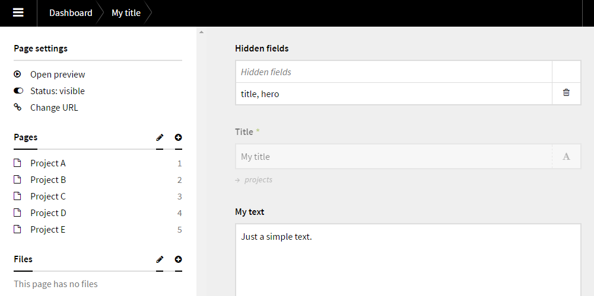
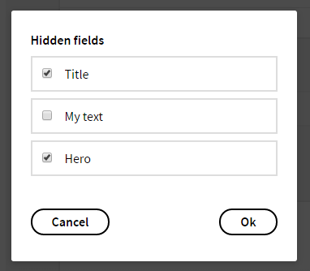

# Kirby Hidden Fields

*Version 0.1* - *[Changelog](docs/changelog.md)*

This field will allow you to select fields that should be hidden. It's already possible to do this in the blueprint, but with this plugin you can have unique visible/hidden fields on each page.

### What's the point?

Let's say you have a simple checkbox on your panel page somewhere and you are not sure if it should be checked or not. A checkbox only have two states, checked or unchecked. It's impossible to know if it's unchecked because it should be false, or if it's unchecked because we are not sure if it should be checked or not.

### Present unknown data as unknown

With this plugin we can flag it as a hidden field to simply say, "I'm not sure about this field". In a snippet we can display a question mark icon or just a "?" for unknown data.



*Hidden fields are in this case "hero" and "title".*



**[Installation instructions](docs/install.md) - Be aware, it's not tested with multi language sites**

## Setup

### Blueprint

To your blueprint fields you need to add two new fields, `hiddenfields` and `hiddenstyle`. I prefer to put the on top, even before the `title` field.

```text
fields:
  hiddenfields: hiddenfields
  hiddenstyle: hiddenstyle

  title:
    label: Title
    type: title
```

## Usage

1. You should now see a structure field in the panel page. Click "Add" or "Add the first entry".
2. Now you see a list of all the fields in the current blueprint. Check the checkboxes on which fields you want to hide.
3. Click "Add" when you have selected the checkboxes
4. Save the page.

The fields you checked should now be 50% transparent.

### Model

If you need to use this in your templates/snippets you could use a [model](https://getkirby.com/docs/developer-guide/advanced/models). That way you can manipulate the output. For example, if a field is hidden, return an empty string, or a question mark icon or just "?".

### Disabled

Be aware that disabled fields and hidden fields, both uses 50% transparency on the element. You can still use both. To see if the field is disabled, just try to edit it. If it's possible to edit it and it's transparent, it's a hidden field.

## Requirements

- [**Kirby**](https://getkirby.com/) 2.4.1+

## Disclaimer

This plugin is provided "as is" with no guarantee. Use it at your own risk and always test it yourself before using it in a production environment. If you find any issues, please [create a new issue](https://github.com/jenstornell/kirby-boiler-plugin/issues/new).

## License

[MIT](https://opensource.org/licenses/MIT)

It is discouraged to use this plugin in any project that promotes racism, sexism, homophobia, animal abuse, violence or any other form of hate speech.

## Credits

- [Jens Törnell](https://github.com/jenstornell)